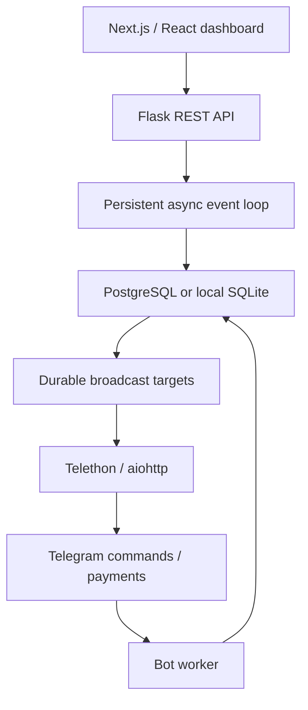

# Architecture and operational contract

## Process layout



Flask request threads submit async DB operations to one persistent loop per web process. Pools never cross event loops, and requests have a bounded 25-second bridge timeout. The static Next.js export is served by Flask on the same origin. React never receives database credentials or the master encryption key.

The bot combines existing aiogram/aiohttp checkout and protected-delivery handlers with native Telethon commands and broadcast sends. Telethon stores its session encrypted in the shared database. When MTProto lacks a recipient access hash, announcements use the aiohttp Bot API fallback. Neither transport uses a user's personal Telegram account.

## Goal 1: configuration and resilience

`config.py` validates required secrets and numeric bounds at process startup, checks production origins and storage, and distinguishes optional local Telethon from required production credentials. Missing production DB/key/web secrets fail immediately. `backend/retry.py` uses bounded exponential backoff with jitter for idempotent metadata/auth-connection operations; it is deliberately not a blanket retry around payments or ambiguous sends.

Payment receipts are persisted before advancing Telegram polling offsets. Atomic grants and unique charge IDs protect against repeated receipts. Row locks serialize PostgreSQL manual approvals; SQLite uses BEGIN IMMEDIATE transactions. Bad receipts stay in reconciliation state instead of granting content. Global error handlers return safe error codes; structured logs exclude request bodies, raw URLs, tokens and research.

## Goal 2: menus and dashboard

A menu page has this contract:

```json
{
  "kind": "catalog",
  "page": 0,
  "size": 8,
  "has_next": true,
  "items": [
    {"id": 1, "label": "Reference collection", "price": {"INR": 1500, "XTR": 100}, "action": "service:1"}
  ]
}
```

Callback payloads remain short identifiers; research never goes into callbacks. Owner authorization is reevaluated for each callback/FSM message.

Component hierarchy: `Layout → Dashboard → Login | WorkspaceShell`; the shell contains `Overview`, `Services → ServiceForm / EntryEditor`, `Records → Users / Transactions / Broadcasts`, and shared `Pager`. Loading/empty/error states, keyboard focus, mobile layout and explicit destructive confirmations are included. Editors use server revisions and receive HTTP 409 on stale saves.

| Endpoint | Purpose |
|---|---|
| POST /api/login, POST /api/logout, GET /api/session | Owner authentication and session revocation |
| GET /api/analytics | Counts, approved revenue by currency, delivery failures |
| GET/POST /api/services | Paginated catalog / creation |
| PATCH /api/services/:id | Revision-checked price/access/name updates |
| GET/POST /api/services/:id/entries | Paginated metadata / encrypted draft creation |
| GET/PATCH/DELETE /api/entries/:id | Owner-only plaintext read / draft edit / delete |
| POST /api/entries/:id/publish | Revision-checked publication |
| GET /api/users, PATCH /api/users/:id | Paginated users and bans |
| GET /api/transactions, POST /api/transactions/:id/review | Ledger and manual verification |
| GET/POST /api/broadcasts | Progress and explicitly confirmed enqueue |

All mutations require exact Origin, JSON, an authenticated owner session and a matching CSRF header. Login additionally has DB-backed rate limits. Cookies are signed, HttpOnly, SameSite=Strict and Secure in production, with two-hour DB-backed validity. Logout revokes the database session. APIs use no-store; static HTML CSP hashes authorize only the generated inline Next.js scripts. Owner-only plaintext reads are audited.

## Goal 3: deployment

Heroku web and worker are separate process types. Node builds Next.js before Python packaging; Flask serves the result. Release migrations are explicit and serially advisory-locked. PostgreSQL is mandatory on Heroku, and its encryption key comes from persistent configuration, never an ephemeral filesystem. Supabase session/direct connections are required. Build duration depends on provisioning, credentials and network; no 60-second guarantee is made.

Termux mode keeps SQLite and can disable Telethon to require only token/owner ID. A persistent local directory and backups are still essential. No platform keeps an Android process alive indefinitely.

## Goal 4: security and modularization

```text
config.py                 validated shared settings
backend/api.py            Flask routes and validation
backend/security.py       admin_required / owner_command decorators
backend/bridge.py          request threads → persistent async loop
backend/database.py        asyncpg pool / SQLite selection
backend/models.py          Pydantic payload allowlists
backend/menus.py           paginated menu JSON
backend/http.py            bounded aiohttp transport
backend/telethon_client.py  native commands and MTProto transport
backend/broadcast.py        leasing, pacing, durable recipient state
bot/                       existing payment/access/vault domain workflows
frontend/app/              Next.js app, dashboard components, Tailwind
migrations/                PostgreSQL schema and least-privilege grants
scripts/                   secret generation, Termux, browser smoke
```

No public Supabase anon/service key is used: the server connects directly using a limited PostgreSQL role. RLS has no public policies; the private schema is not exposed in Data API. Migrator credentials, when configured on Heroku, are still sensitive server secrets; operators wanting tighter separation should run migrations externally and adjust the release process.

Local DB flags/timestamps use a portable numeric representation. The PostgreSQL adapter converts only fixed dialect expressions (`now()` epoch and two-argument greatest); user data remains parameterized. PostgreSQL timestamps are stored as UTC epoch seconds for compatibility with retained SQLite data models.

## Goal 5: broadcast scaling algorithm

1. Snapshot unbanned recipients into `broadcast_targets` once per confirmed broadcast, with a unique `(broadcast_id,user_id)` key.
2. Four async consumers share one global pacer. Default eight sends/second; configuration bounds it to 1–20.
3. After pacing, claim one due target with a two-minute lease and random lease token. PostgreSQL uses FOR UPDATE SKIP LOCKED; SQLite serializes the write transaction.
4. Recheck current ban state, decrypt the announcement in memory and send with protection. Each network send is bounded to 30 seconds.
5. On Telegram FloodWait/429, defer the target and pause the shared pacer. On recipient-unavailable errors, mark it failed. Other errors use capped exponential delay, up to eight attempts.
6. Mark success only when the lease token still matches. Expired leases can be reclaimed after a crash. Mark the broadcast complete when no queued/leased recipients remain.

This is at-least-once delivery around ambiguous network failures: a send accepted by Telegram but not acknowledged to this process may be repeated. Do not claim exactly-once delivery. The global Telegram rate budget currently assumes **one bot worker**; horizontal scaling is for web processes. Multiple broadcast dynos would need a shared distributed rate budget and a separate bot-session design.

Analytics records route patterns, response codes and timings; database audit entries record actor/action/object IDs. Queue counts and failures are available in the owner dashboard. Alert on reconciliation receipts, repeated delivery failures, overdue deletions and sustained queue age.

## End-to-end trace verified by tests

A service is edited via authenticated API → encrypted draft is saved → owner publishes it → bot paginated menu reads the same row → buyer transaction snapshots the price → checked payment grants access and queues delivery atomically → worker checks entitlement and sends protected content → analytics API reports the same approved transaction to React.

The automated trace uses synthetic Telegram sender/payment events. Real Telegram authorization, actual Stars payments/refunds, Supabase connectivity and Heroku dyno lifecycle are separate live acceptance gates. The code does not guarantee legal results, anti-piracy, deletion during outages or zero downtime.

## Mobile deployment and owner login
Heroku generates independent persistent MASTER_KEY_SEED and SECRET_KEY values. Explicit Fernet keys remain supported and take precedence. `/dashboard` authenticates the private Telegram owner, issues 192 random bits and stores only a SHA-256 digest with a five-minute expiry. A database transaction consumes the code once; issuing a new code invalidates the previous code. Login throttling, session revocation and CSRF apply to both code and optional legacy password login. The database URL remains a private deployment setting, never a public manifest default.
